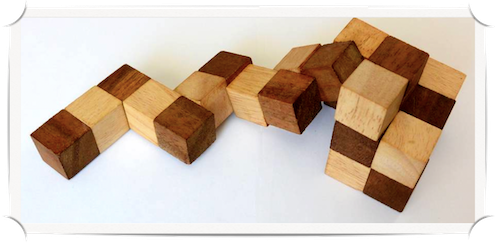

## Blocks

This repository includes:
- `puzzle.py`: Creates search space and search algorithm.
- `search.py`: Implementation of search algorithms.

This project is from an Artifical Intelligence course at Williams College taught by Mark Hopkins Fall 2022.